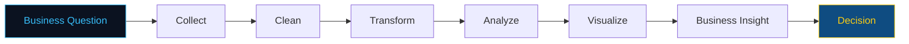
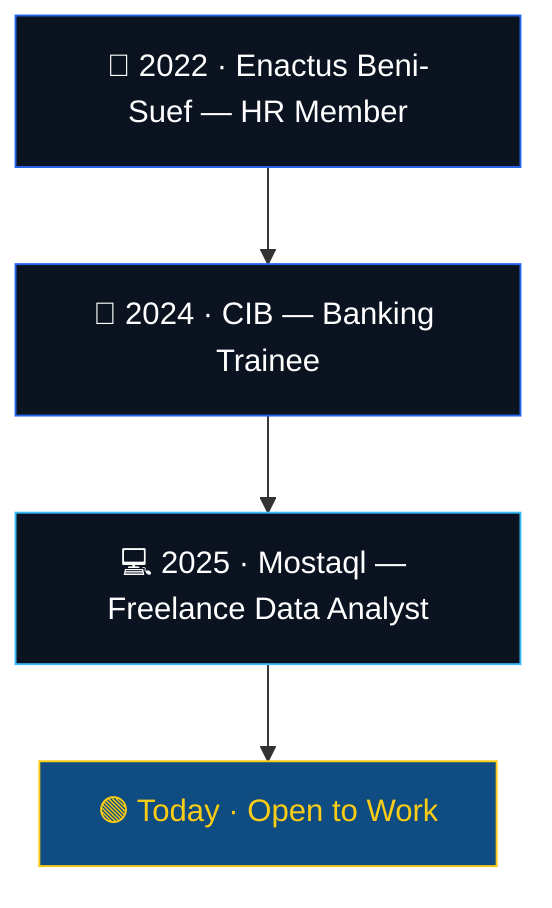

 
<table width="100%" border="0" cellpadding="0" cellspacing="0">
<tr>
<td width="60%" valign="middle">

👋 As-salamu Alaikum

# Abdulrahman Muhammad

### `DATA ANALYST`

**Business-minded Data Analyst** — I read the business problem first, then let the data answer it.

> *From Raw Data to Smart Decisions.*

 

 

</td>
<td width="40%" align="right" valign="middle">

</td>
</tr>
</table>

 

<!-- ============================= NAVBAR ============================= -->

 

<!-- ============================= PROFILE CARD ============================= -->

<table>
<tr><td>

**🪪 PROFILE**

| | |
|---|---|
| 📍 **Country** | Egypt 🇪🇬 |
| 💼 **Role** | Data Analyst |
| 🟢 **Availability** | Open to Work |
| 🤝 **Engagement** | Full-time · Remote · Freelance |
| ⏱ **Response Time** | Usually within 24h |
| 🌍 **Domains** | Banking · Finance · Retail · BI · ERP |

</td></tr>
</table>

---

## 01 · About

I'm not a technical analyst who happens to know Excel. I'm a **Bachelor of Commerce (Accounting) graduate** who happened to fall in love with data — and that order matters.

Accounting is my unfair advantage. Before I build a single pivot table, I already understand:

`Financial Statements` · `KPIs` · `Profitability` · `Budgeting` · `Business Reporting` · `Decision-Making`

I pair that business fluency with technical execution in `Excel` · `SQL` · `Power BI` · `Power Query` · `DAX` · `Python` — so the dashboards I build don't just look good, they answer the question the business is actually asking.

 

<table width="100%">
<tr>
<td width="25%" align="center">

**🧠 Business Intelligence**
 Reports built around decisions, not just data

</td>
<td width="25%" align="center">

**💰 Financial Analytics**
 Accounting-grade accuracy

</td>
<td width="25%" align="center">

**📊 Dashboard Design**
 Interactive, filterable, executive-ready

</td>
<td width="25%" align="center">

**⚙️ Excel Automation**
 VBA-driven, one-click reporting

</td>
</tr>
<tr>
<td width="25%" align="center">

**📈 Data Visualization**
 Insight over decoration

</td>
<td width="25%" align="center">

**🎯 Decision Support**
 Turning numbers into next steps

</td>
<td width="25%" align="center">

**🏢 Business Analysis**
 Problem-first, tool-second

</td>
<td width="25%" align="center">

**🧹 Data Transformation**
 Clean data, trusted decisions

</td>
</tr>
</table>

 

---

## 02 · Impact in Numbers

<table>
<tr>
<td align="center" width="20%">

### 10+
Projects Delivered

</td>
<td align="center" width="20%">

### 80K+
Rows Analyzed

</td>
<td align="center" width="20%">

### 5+
Dashboards Shipped

</td>
<td align="center" width="20%">

### 40%
Time Saved via Automation

</td>
<td align="center" width="20%">

### 1st
University Rank

</td>
</tr>
</table>

---

## 03 · Featured Projects

<table width="100%">
<tr>
<td width="50%" valign="top">

### 📊 Data Science Salary Dashboard

**Problem:** Job seekers and recruiters had no fast way to benchmark Data Science salaries across 32,000+ real records.
**Solution:** Excel dashboard with `MEDIANIFS`, Power Query modeling, and 3 dynamic filters.
**Impact:** 8 live KPIs · fully interactive · instant salary benchmarking.

`Excel` `Power Query` `Pivot Tables`

[**Live Demo →**](https://mostaql.com/portfolio/3116866-data-science-salary-dashboard)

</td>
<td width="50%" valign="top">

### 📈 Data Science Job Market Analysis

**Problem:** Thousands of job postings, zero visibility into skill demand or salary trends by country.
**Solution:** 5-page Power BI dashboard on a star-schema model with 20+ DAX measures.
**Impact:** Country comparison, skills ranking, and demand trends in one view.

`Power BI` `DAX` `Power Query`

[**Live Demo →**](https://sites.google.com/view/abdu-datanerd/project-page/4)

</td>
</tr>
<tr>
<td width="50%" valign="top">

### 🏢 BM Company Sales Dashboard

**Problem:** 14 years of sales history (~50,000 rows) with no executive-level visibility.
**Solution:** Dynamic Excel dashboard using `SUMIFS`, `INDEX/MATCH`, built for management review.
**Impact:** Instant performance evaluation across 2010–2024.

`Excel` `SUMIFS` `INDEX/MATCH`

[**Live Demo →**](https://sites.google.com/view/abdu-datanerd/project-page/5)

</td>
<td width="50%" valign="top">

### ⚡ Social Reports Automation

**Problem:** Weekly reports were 100% manual — slow and error-prone.
**Solution:** One-click Excel VBA automation replacing the entire manual process.
**Impact:** 40% reduction in reporting time, zero manual steps left.

`Excel VBA` `Macros`

[**Portfolio →**](https://mostaql.com/u/abdulrahman0328/portfolio)

</td>
</tr>
</table>

More projects on <a href="https://mostaql.com/u/abdulrahman0328/portfolio">Mostaql →</a>

---

## 04 · Career Timeline

<table width="100%">
<tr><td>

**💻 Freelance Data Analyst** — Mostaql Platform
Dashboard development, financial reporting, Excel automation, data cleaning & transformation, direct client communication.

</td></tr>
<tr><td>

**🏦 Banking Trainee** — Commercial International Bank (CIB) · Aug 2024
Banking operations, financial reporting, customer data analysis, performance monitoring.

</td></tr>
<tr><td>

**🤝 HR Member** — Enactus Beni-Suef · Mar 2022 – May 2023
Team management, HR operations, project coordination, leadership.

</td></tr>
</table>

---

## 05 · Tech Stack

<table width="100%">
<tr>
<td align="center" width="20%"><b>Analytics</b></td>
<td width="80%">

</td>
</tr>
<tr>
<td align="center"><b>Programming</b></td>
<td>

</td>
</tr>
<tr>
<td align="center"><b>Business</b></td>
<td>

</td>
</tr>
<tr>
<td align="center"><b>Automation</b></td>
<td>

</td>
</tr>
<tr>
<td align="center"><b>Office & Tools</b></td>
<td>

</td>
</tr>
</table>

**🎯 Currently Sharpening:** Advanced SQL · Advanced DAX · Power BI Data Modeling · Python for Analytics

---

## 06 · Education & Certifications

<table width="100%">
<tr>
<td align="center" width="25%">🪪 <b>MOS</b> Microsoft Office Specialist ✅ Completed</td>
<td align="center" width="25%">🪪 <b>ICDL</b> Int'l Computer Driving License ✅ Completed</td>
<td align="center" width="25%">🪪 <b>CIB Training</b> Banking Program ✅ Completed</td>
<td align="center" width="25%">🪪 <b>IFRS</b> Financial Reporting Standards 🔄 In Progress</td>
</tr>
</table>

---

## 07 · Why Work With Me

<table width="100%">
<tr>
<td width="20%" align="center"><b>🧭</b> Business-First Mindset</td>
<td width="20%" align="center"><b>📚</b> Real Accounting Advantage</td>
<td width="20%" align="center"><b>📊</b> Business Intelligence Focus</td>
<td width="20%" align="center"><b>⚙️</b> Automation-Driven</td>
<td width="20%" align="center"><b>🗣️</b> Clear Client Communication</td>
</tr>
</table>

---

## 08 · GitHub Activity

 

 

 

ℹ️ The animated "snake" contribution graph isn't included by default — it needs a GitHub Actions workflow running on your own repo. Say the word and I'll write that workflow file for you.

---

## 09 · Let's Build Something Meaningful with Data

**Have a dataset that needs to become a decision? Let's talk.**

---

**Abdulrahman Muhammad** · DATA ANALYST · From Raw Data to Smart Decisions

