 

  

<b>
<a href="#about">About Me</a> &nbsp;•&nbsp; 
<a href="#skills">Skills</a> &nbsp;•&nbsp; 
<a href="#projects">Projects</a> &nbsp;•&nbsp; 
<a href="#freelance">Freelance</a> &nbsp;•&nbsp; 
<a href="#education">Education</a> &nbsp;•&nbsp; 
<a href="#contact">Contact</a>
</b>

---

## 👨‍💼 About Me

I'm a **Junior Data Analyst** with a **Commerce & Accounting background**. My foundation in accounting ensures accuracy and deep financial interpretation, while my data skills turn those numbers into practical dashboards, reporting solutions, and clear **Business Insights**. 

> **Accounting → Financial Thinking → Data Analysis → Business Intelligence**

---

## 🛠️ Technical Skills

*Click on any skill to explore my specific expertise and projects related to it.*

### Core & Building

### Planned (Next Steps)

---

## 📊 Featured Projects

### 1. Data Job Market Dashboard
* **Tech Stack:** Power BI | DAX | Power Query | Excel
* **Business Impact:** Analyzed +479K job postings to provide salary benchmarks, identify demand trends, and clarify the global data job market for job seekers.
* 

### 2. Data Science Salary Dashboard
* **Tech Stack:** Excel (Advanced Formulas, Pivot Tables, Dynamic Arrays)
* **Business Impact:** Developed an interactive dashboard analyzing 32,672 job postings to track median salaries, country comparisons, and employment types.
* 

### 3. BM Company Sales Dashboard
* **Tech Stack:** Excel Data Analysis
* **Business Impact:** Analyzed 50,000+ records to evaluate regional sales performance, product-level comparisons, and yearly trends.

---

<b>💼 Freelance Experience (Mostaql) — <i>Click to expand</i></b>

 

Delivered independent data management and reporting solutions focused on structuring data, minimizing manual effort, and maximizing accuracy.

* **Financial Reporting Solutions:** Streamlined income/expense tracking workflows, cutting per-record processing time by over **60%** and minimizing human error.
* **Data Migration & Management:** Developed structured data-transfer systems that reduced manual entry time across sales representatives by over **40%**.
* **Dynamic Financial Dashboards:** Built interactive calculators and multi-criteria filtering tools for instant, reliable business summaries.
  

<b>🎓 Education & Certifications — <i>Click to expand</i></b>

 

**Academic Background**
* **B.Com. — Accounting (English Section)** | Beni-Suef University (2025)
  * **Overall Grade:** Very Good with Honors (86.4%).
  * **Achievement:** Ranked **1st university-wide** among Accounting majors in the final specialization year with a score of **94%**.

**Certifications & Training**

| Year | Certification / Training Track | Institution |
| :--- | :--- | :--- |
| **2024** | Banking Data Literacy & Analytics Training (August) | CIB Bank |
| **2024** | Microsoft Office Specialist (MOS) | Microsoft |
| **2025** | Excel for Data Analytics | Luke Barousse |
| **2026** | Power BI for Data Analytics | Luke Barousse |
| **2026** | SQL Full Course (30 Hours) — Beginner to Advanced | Data With Baraa |

<b>🧠 Analytical Approach & Roadmap — <i>Click to expand</i></b>

 

**My Data Methodology**
> **Business Question** → **Context** → **Data Preparation** → **Analysis** → **Visualization** → **Business Insight**

**Learning Roadmap**
Currently building deep expertise in **SQL**, **Power Query**, and **DAX** to transition raw data into structured, decision-ready models.

---

<b>Ready to turn your scattered data into clear business insights? Let's connect!</b>  

